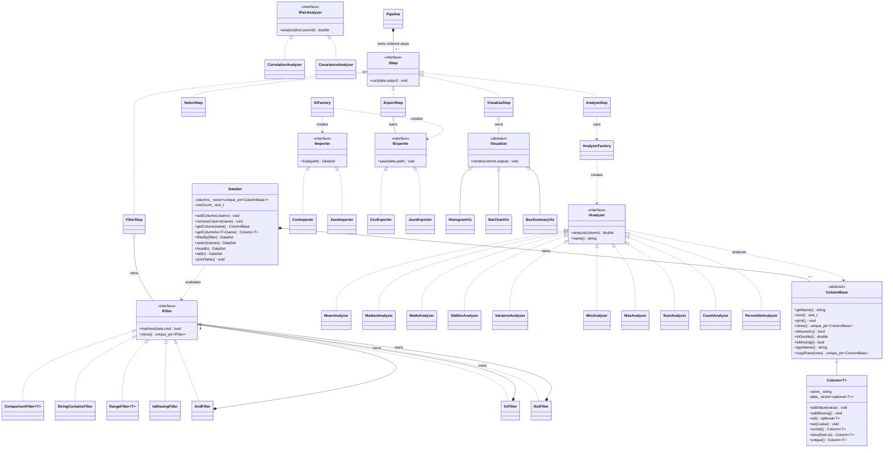

# Data Analytics Library

A beginner-oriented C++17 library for working with typed tabular data. The project demonstrates object-oriented design through typed columns, analyzer strategies, composable filters, interchangeable file formats, visualizers, and an ordered processing pipeline.

## Architecture overview

| Component | Responsibility | Main files |
|---|---|---|
| Core data | Store typed values and manage rows and columns | `include/dal/ColumnBase.h`, `include/dal/Column.h`, `include/dal/DataSet.h`, `src/DataSet.cpp` |
| Analytics | Calculate summary and paired statistics | `include/dal/IAnalyzer.h`, analyzer headers in `include/dal/`, analyzer sources in `src/` |
| Visualizers | Render numeric and category summaries | `include/dal/Visualizer.h`, `src/HistogramViz.cpp`, `src/BarChartViz.cpp`, `src/BoxSummaryViz.cpp` |
| Query | Match rows using simple or combined conditions | `include/dal/IFilter.h`, `include/dal/Filters.h`, `src/AndFilter.cpp`, `src/OrFilter.cpp`, `src/NotFilter.cpp` |
| File I/O | Read CSV/JSON and write CSV/JSON | `include/dal/IO.h`, `src/CsvImporter.cpp`, `src/JsonImporter.cpp`, `src/CsvExporter.cpp`, `src/JsonExporter.cpp` |
| Pipeline | Run filter, select, analysis, visualization, and export steps in order | `include/dal/Pipeline.h`, `src/Pipeline.cpp` |

`DataSet` owns its columns with `unique_ptr<ColumnBase>`. A `Column<T>` keeps values of one type in a vector of optional values. The base interface lets the dataset and analytics code work with a column without knowing its concrete type in advance.

## Course concepts and where to find them

| Concept | Example classes | Files and explanation |
|---|---|---|
| Abstraction | `ColumnBase`, `IAnalyzer`, `IFilter`, `IImporter`, `IExporter`, `Visualizer`, `IStep` | `include/dal/ColumnBase.h`, `IAnalyzer.h`, `IFilter.h`, `IO.h`, `Visualizer.h`, `Pipeline.h`; each defines a contract for other classes. |
| Inheritance | `Column<T>`, `MeanAnalyzer`, `AndFilter`, `CsvImporter`, `HistogramViz`, `FilterStep` | These derive from an abstract base or interface and provide concrete behavior. See their headers under `include/dal/`. |
| Polymorphism | `DataSet`, `AnalyzerFactory`, `Pipeline` | `src/DataSet.cpp`, `src/AnalyzerFactory.cpp`, `src/Pipeline.cpp`; virtual calls dispatch to the stored concrete column, analyzer, filter, or step. |
| Virtual functions | All interface base classes | Each base declares virtual operations and has a virtual destructor; implementations use `override`. |
| Templates | `Column<T>`, `ComparisonFilter<T>`, `RangeFilter<T>` | `include/dal/Column.h` and `include/dal/Filters.h`; one implementation works with multiple value types. |
| Encapsulation | `Column<T>`, `DataSet`, `Pipeline` | Private vectors and pointers hide ownership and stored values; callers use public methods. |
| Strategy pattern | `IAnalyzer`, `Visualizer`, `IImporter`, `IExporter` | Implementations can be selected without changing the calling code. |
| Composite pattern | `AndFilter`, `OrFilter`, `NotFilter` | `include/dal/Filters.h` and the matching source files; simple filters can be nested. |
| Factory pattern | `AnalyzerFactory`, `IOFactory` | `src/AnalyzerFactory.cpp` and `src/IoFactory.cpp` create implementations based on a name or file extension. |
| Decorator pattern | `AnalyzerDecorator`, `LoggingAnalyzer`, `RoundingAnalyzer` | `include/dal/AnalyzerDecorator.h` wraps an analyzer while preserving its interface. |
| Command pattern | `ICommand`, `CommandShell` | `include/dal/CommandShell.h` and `src/CommandShell.cpp` turn parsed requests into command objects. |
| Composition and ownership | `DataSet`, `Pipeline`, composite filters | Each owns child columns, steps, or filters through `unique_ptr`. |

## Phase 3 extensions

`DataSet` now supports deep copy and move, stable sorting, inner joins, and grouped
aggregates (`groupBy(...).agg("mean", ...)`). `SummaryReport` creates a describe-style
table, `AnalyzerDecorator` adds logging and rounding, and `CorrelationMatrixViz`
prints an ASCII correlation matrix. `CommandShell` turns text commands into polymorphic
command objects. The `performance_test` target times a generated 100,000-row CSV.

## Build and run

Configure and build from the repository root:

```sh
cmake -S . -B build
cmake --build build
ctest --test-dir build --output-on-failure
```

Alternatively, with GNU Make installed, use `make`, `make run`, `make test`, or
`make performance`. Run `make clean` to remove generated build files.

Run the demo from the repository root:

```sh
./build/dal_demo
```

On Windows, the executable may be under `build/Debug/dal_demo.exe` or `build/Release/dal_demo.exe`, depending on the generator. The demo reads `data/students.csv` and writes filtered CSV and JSON files in `data/`.

## Small usage example

```cpp
#include "dal/Filters.h"
#include "dal/IO.h"

using namespace std;
using namespace dal;

int main() {
    unique_ptr<IImporter> importer = IOFactory::makeImporter("data/students.csv");
    DataSet students = importer->load("data/students.csv");

    FilterHandle condition = gt("gpa", 8.0) && lt("age", 22);
    DataSet honors = students.filterBy(condition).select({"name", "gpa"});
    honors.printTable();
}
```

The full example is in `demo/main.cpp`. It loads the sample, prints the original table, filters and selects rows, calculates summaries, renders a histogram and category chart, and exports the result through a `Pipeline`.

## Demo menu

Run the demo and enter a menu number to view the table, summary, GPA histogram, city bar chart, GPA box summary, or correlation matrix. Enter `0` to exit.

## UML class diagram


