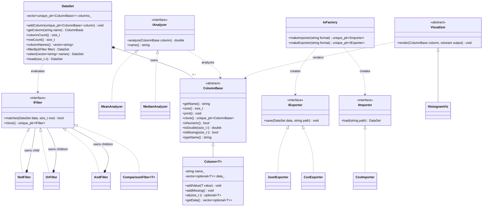

# Data Analytics Library: Class Diagram

```mermaid
classDiagram
    class ColumnBase {
      <<abstract>>
      +getName() string
      +size() size_t
      +print() void
      +clone() unique_ptr~ColumnBase~
      +isNumeric() bool
      +toDouble(size_t i) double
      +isMissing(size_t i) bool
      +typeName() string
    }
    class Column~T~ {
      -string name_
      -vector~optional~T~~ data_
      +addValue(T value) void
      +addMissing() void
      +at(size_t i) optional~T~
      +getData() vector~optional~T~~
    }
    class DataSet {
      -vector~unique_ptr~ColumnBase~~ columns_
      +addColumn(unique_ptr~ColumnBase~ column) void
      +getColumn(string name) ColumnBase
      +columnCount() size_t
      +rowCount() size_t
      +columnNames() vector~string~
      +filterBy(IFilter filter) DataSet
      +select(vector~string~ names) DataSet
      +head(size_t n) DataSet
    }
    class IAnalyzer {
      <<interface>>
      +analyze(ColumnBase column) double
      +name() string
    }
    class MeanAnalyzer
    class MedianAnalyzer
    class IFilter {
      <<interface>>
      +matches(DataSet data, size_t row) bool
      +clone() unique_ptr~IFilter~
    }
    class ComparisonFilter~T~
    class AndFilter
    class OrFilter
    class NotFilter
    class IImporter {
      <<interface>>
      +load(string path) DataSet
    }
    class IExporter {
      <<interface>>
      +save(DataSet data, string path) void
    }
    class CsvImporter
    class CsvExporter
    class JsonExporter
    class IoFactory {
      +makeImporter(string format) unique_ptr~IImporter~
      +makeExporter(string format) unique_ptr~IExporter~
    }
    class Visualizer {
      <<abstract>>
      +render(ColumnBase column, ostream output) void
    }
    class HistogramViz

    ColumnBase <|-- Column
    IAnalyzer <|.. MeanAnalyzer
    IAnalyzer <|.. MedianAnalyzer
    IFilter <|.. ComparisonFilter
    IFilter <|.. AndFilter
    IFilter <|.. OrFilter
    IFilter <|.. NotFilter
    IImporter <|.. CsvImporter
    IExporter <|.. CsvExporter
    IExporter <|.. JsonExporter
    Visualizer <|-- HistogramViz
    DataSet *-- "0..*" ColumnBase : owns
    AndFilter *-- IFilter : owns children
    OrFilter *-- IFilter : owns children
    NotFilter *-- IFilter : owns child
    DataSet ..> IFilter : evaluates
    IoFactory ..> IImporter : creates
    IoFactory ..> IExporter : creates
    IAnalyzer ..> ColumnBase : analyzes
    Visualizer ..> ColumnBase : renders
```